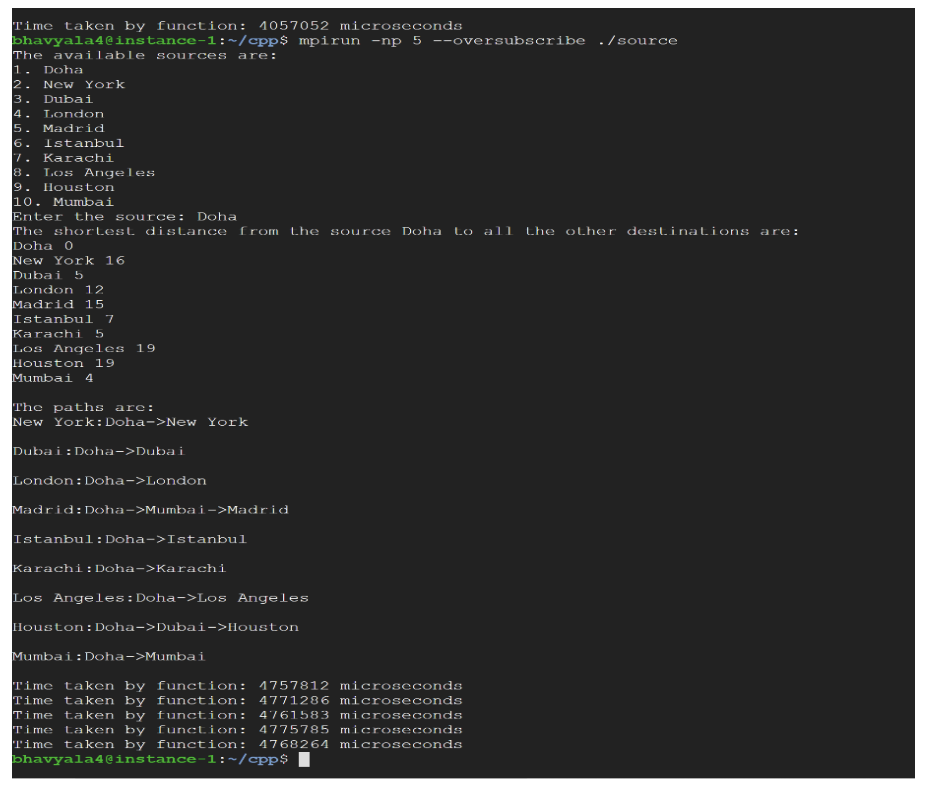

# Parallel Dijkstra's Algorithm

This program uses the MPI (Message Passing Interface) library to parallelize Dijkstra's algorithm, enhancing the efficiency of finding the shortest distances from a source to multiple destinations. The program utilizes Google Cloud Platform (GCP) for performance comparisons on various machines with different configurations.

---

## How to Run the Code on a Local Machine

1. **Install MinGW**:
   - Download from [MinGW official site](https://www.mingw-w64.org/).

2. **Install Visual Studio 2019**:
   - Download from [Visual Studio 2019](https://docs.microsoft.com/en-us/visualstudio/releases/2019/release-notes).

3. **Configure MinGW in Visual Studio**:
   - Open the Visual Studio Installer and click "Modify."
   - Install the **Desktop development with C++** workload.

4. **Load the Submitted Project**:
   - Open Visual Studio, click on "Open Project," and load the submitted project.

5. **Update Project Properties**:
   - Navigate to `Project -> Test Properties -> C/C++ -> Additional Include Directories -> Edit`.
   - Add the directory: `C:\Program Files (x86)\Microsoft SDKs\MPI\Include`.
   
6. **Update Linker Settings**:
   - Navigate to `Project -> Test Properties -> Linker -> Additional Library Directories -> Edit`.
   - Add the directory: `C:\Program Files (x86)\Microsoft SDKs\MPI\Lib\x86`.

7. **Run the Code**:
   - Click "Run Local Debugger" to execute the program locally.

8. **Run on Multiple Processors**:
   - Navigate to `\project_mpi\Debug`.
   - Open the command prompt in this directory.
   - Run the command:
     ```bash
     mpiexec -n 5 project_mpi.exe
     ```

---

## How to Run the Code on Google Cloud Platform (GCP)

1. **Create a Virtual Machine Instance**:
   - Use the GCP console to create a new project.
   - Set up a virtual machine instance named `e2-standard-4`.

2. **Install MPI Library**:
   - Run the following commands on the VM:
     ```bash
     sudo apt-get install lam4-dev
     sudo apt-get install lam-runtime
     lamboot
     ```

3. **Upload and Compile the Code**:
   - Create a new C++ file on the VM and paste the provided code from the zip file.
   - Compile the code using:
     ```bash
     mpicxx -o source project.c
     ```

4. **Run the Program**:
   - Execute the following command to run the program:
     ```bash
     mpirun -np 5 --oversubscribe ./source
     ```

---

## Languages and Utilities Used

- **PowerShell**
- **Visual Studio**
- **MPI Library**
- **C++**

---

## Results

Running the algorithm on a GCP instance using multiple processors significantly improved efficiency.



---

## Environments Used

- **Windows 10** (21H2)
